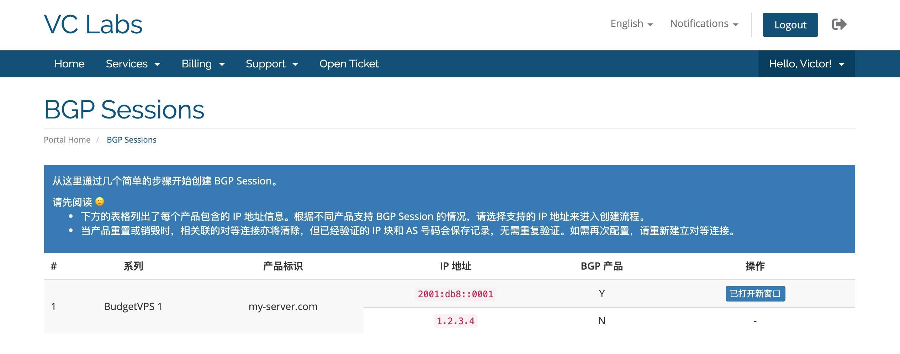
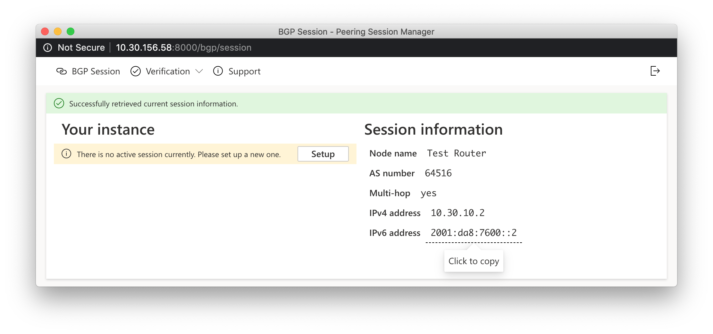
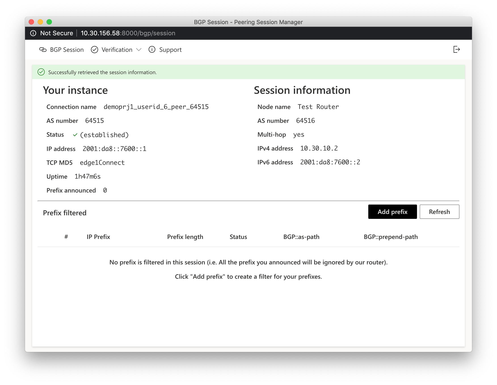

## Peering Manager for Service-Providers

Authorization and operatiing client for WHMCS billing system of Peering Manager.
用于 WHMCS 财务系统的 BGP Peering Manager 认证和操作客户端

### 安装

1. 将整个文件夹放置在 `[WHMCS 根目录]/modules/addons/` 下
2. 进入 WHMCS Admin，导航到 Setup - Addon Modules，选择 `Peering Manager - WHMCS Client` 并激活。

### 配置项

在激活模块后，会看到五个配置项。每个配置项的用户和配置方法如下：

- 前端地址

用户访问的界面地址。带  `https:// `，不带最后的  `/`。

- 后端地址

完整的后端数据接口地址，到 `/admin` 之前。同样带 `http://`，不带最后的  `/`。

- Product IDs

开启 BGP Session 的产品 ID 列表，由一组 ID 和每个 ID 的描述组成，以 `|` 分隔。ID 和描述间用 `:` 分隔。

例如：

为 WHMCS 中的产品 ID 2 的启用 IPv4 BGP Session 和 IPv6 BGP Session，则填写 `2:4,6`  ；

为 WHMCS 中的产品 ID 19 的只 IPv6 BGP Session，则填写 `19:6` ；

同时将规则应用到两个产品，最终在配置栏中填入 `2:4,6|19:6` 。

- Identifier

后端接口通信密钥。与后端 `config.yaml` 的 `identifier` 配置项保持一致。

- 产品:路由对应 ID

产品 ID 是 WHMCS 系统中的 pid，路由 ID 是后端数据库 `router` 表中的主键 ID。

例如产品 ID 1 对应路由 ID 3，产品 ID 12 对应 路由 ID 1, 填写："1:3|12:1"（不包含引号）。

### 用户操作
用户可以直接访问 `index.php?m=peer_man_whm_client` 来进行下一步操作，也可以在产品页面内输出的按钮来进入中间平台，进入的界面如下

- 用户产品页面 `(clientproductdetails)`  输出的按钮在 `hooks.php` 的 `ClientAreaProductDetailsOutput` 钩子里渲染，SP 可以根据前端需要进行修改
- 在所有开启了 BGP Session 功能的地址右侧会有按钮，点击按钮会向后端请求一枚一次性登录链接，接着会弹出这一个链接。

进入 BGP Manager 控制页面后，界面如下。

在用户创建好连接后，界面如下。

相关操作均有引导按钮，会较为顺利地带领用户完成设置步骤，这里不再赘述。有关前后端数据交互信息，转到对应仓库来查看。

### TODO List

- [ ] 语言 i18n - 英语支持
- [ ] ...